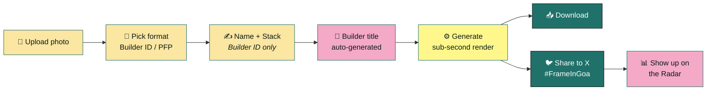

<div align="center">


<br/>

[](https://hhgoa.com)
[](https://hhgoa.com/radar)
[](https://twitter.com/hashtag/FrameInGoa)
[]()

</div>

<br/>

> **"Most hackathons are just hype and no substance... lock in and build your legacy."**
> — hhgoa.com. This tool exists to hand every builder a real, timestamped credential for showing up. Not a filter. Not a badge with a logo pasted on it. An **issuance**.

---

## ⚡ What this is

<table>
<tr>
<td width="50%" valign="top">

### 🪪 Format B — Builder ID Card
*(primary / default flow)*

Upload a photo → add name + stack/role → get a deterministic **builder title** → download a card that looks like an event credential, not a meme.

Front: photo + identity. Back: QR → public profile page.

</td>
<td width="50%" valign="top">

### 🖼️ Format A — PFP Frame
*(fast / lightweight path)*

Zero fields. Upload → frame wraps the photo in HH Goa branding → instant X profile picture. One tap faster for people who just want a PFP.

</td>
</tr>
</table>

<div align="center">
<sub>Both flows: no login wall · no signup gate · one pass, start to finish</sub>
</div>

---

## 🎬 Flow



---

## 🎨 Color system

<div align="center">

| Token | Swatch | Hex | Role |
|---|---|---|---|
| `--surface-dark` |  | `#0B1B19` | Primary background |
| `--surface-light` |  | `#FBE6A2` | Paper / light-mode surface |
| `--primary` |  | `#20716A` | Official identity color |
| `--accent-signal` |  | `#FFF78C` | One hero action per screen |
| `--accent-warm` |  | `#F4A9C7` | Secondary accent |

<sub>Discipline rule: never more than 2 of the 4 accents on one screen, beyond base teal/dark.</sub>

</div>

---

## 🧱 Tech stack

<div align="center">


</div>

**Everything client-side by default** — upload, HEIC conversion, crop/zoom/pan, Canvas compositing, export, download. Supabase enters only when a card is made shareable: one storage bucket (composited image only, never the source photo) + one Postgres table.

```
short_id → { name, stack, title, socials?, image_url, created_at }
```

---

## 📂 Project structure

```
/assets
  /brand        → logo (SVG + transparent PNG + mono), wordmark, Hindi-script mark
  /frames       → frame-01-minimal.svg … frame-04-builder-grid.svg
  /patterns     → line-grid.svg, coordinate-marks.svg
  /icons        → custom-styled social icons
  /fonts        → display + mono .woff2
  /qr           → styling config only (QR generated at runtime)

/frames.ts       → config-driven frame registry
/app
  /                    → generator (home IS the tool)
  /builder/[id]        → public result page (SSR, OG image = generated card)
  /radar               → external link out, not rebuilt
```

---

## 🧩 Frame variants (v1)

<div align="center">

|  |  |  |  |
|:---:|:---:|:---:|:---:|
| Minimal | Terminal / Signal | Goa-Motif | Builder Grid |

</div>

---

## 🚀 Getting started

```bash
git clone https://github.com/hhgoa/frame-generator.git
cd frame-generator
npm install
npm run dev
```

<details>
<summary><b>Environment variables</b></summary>

```env
NEXT_PUBLIC_SUPABASE_URL=
NEXT_PUBLIC_SUPABASE_ANON_KEY=
SUPABASE_SERVICE_ROLE_KEY=
```

No auth provider required for v1 — public bucket + single table only.

</details>

<details>
<summary><b>Build order (recommended sequence)</b></summary>

1. Design system tokens + Figma frame set (4 variants, front + back)
2. Static component shells with mock data
3. Client-side image pipeline end-to-end for one frame
4. Wire remaining 3 frames into the config-driven system
5. Builder title generator + optional-socials form
6. Supabase table + storage + `/builder/[id]` OG page
7. Share flow: X intent + Web Share API
8. Error states, accessibility pass, real-device testing
9. Team frame *(v2)*

</details>

---

## ✅ Roadmap

**V1 — shipping**
- [x] Single-person Builder ID + PFP Frame, 4 frame variants
- [x] Live client-side editing, zero login
- [x] Deterministic builder-title generator
- [x] Optional socials, progressive disclosure
- [x] QR + public profile page + full OG share flow
- [x] Download + Share to X

**V2 — deferred**
- [ ] Team frame (1–3 people)
- [ ] Independent "show on card" vs "show on profile" toggles
- [ ] 2 additional frame variants (data-driven pick)

---

## 🔐 Privacy

Generated and previewed **entirely locally** by default. The original source photo is never uploaded — only the final composited image, and only the moment you choose to make it shareable.

---

<div align="center">

### 🐦 Share it

```
Just got issued my HH Goa 2026 builder credential 🪪
#FrameInGoa
```

<sub>Tracked live on the <a href="https://hhgoa.com/radar">W Celeb Radar</a> — ranked by tweet views.</sub>

<br/><br/>


**4 days. One rhythm. Everything intentional.**

</div>
